# 数学物理方法试卷及解析

> 最早发布在知乎: [数学物理方法试卷及解析](https://zhuanlan.zhihu.com/p/18473861179)

## 背景

笔者本学期学习了数学物理方法这门课程, 收获了不少数学上的启发. 同时也想在假期练习一下Latex, 于是根据自己对于学习课程的体系结构的理解, 出了一套题目.

### 题目来源:

老师上课PPT中的题目(包括例题和作业题)及其变式
部分仿照本班期末考试题目
自己在网络上搜寻的题目

### 注意

**本卷试题结构, 考试时间, 出题风格以及分数设置等和真实的期末试卷迥异, 希望不要产生误导.**

试卷和解析的符号及用语习惯都基本遵照任课老师的风格, 可能在某些方面和主流教材有较大不同.

符号特别说明:(可能不符合学术规范)

1. 自然常数 e 全部采用正体( Latex中, 即\mathrm{e} ).
2. 虚数单位 i 全部采用默认斜体. (注意: 正体才是更规范的写法)
3. 傅氏变换和拉氏变换的符号在试卷和解析中存在差异, 这是使用的模版不同导致的, 暂时没有很好的解决方案, 见谅.

笔者本身水平有限, 并在完稿后简单校验即进行发布, 暂未进行全卷重算核查工作, 答案部分很可能存在错误. 所以希望读者在查看答案时抱有比平常更多的批判眼光, 也欢迎联系并指出我的错误.

## 试卷

分数计算说明:

- 笔者个人想法是, 学生在某些板可能稍薄弱, 但在另一些板块可能学的较好. 所以若第一部分未能拿到高分, 可以在附加题部分选择自己擅长的题目作答, 让自己的纸面分数更高.
- 同时参考学校强制及格线设计, 保证学生至少在每个板块都掌握了基本的知识. 防止过分偏科但仍然能通过教学考核的情况.(比如完全不做数理方程部分的题目, 做完复变函数的题目+一部分附加题也可以将近满分, 但这是不合理的)
- 但笔者毕竟没有较多赋分经验, 也没有在解析中给出每个步骤的分数, 所以并不需要过于严肃地对待分数问题. 专心于题目才是更合理的做法.

基于模版: [如何用latex出数学卷子?](https://www.zhihu.com/question/402111484) 中最高赞模版, 自己做了部分修改.

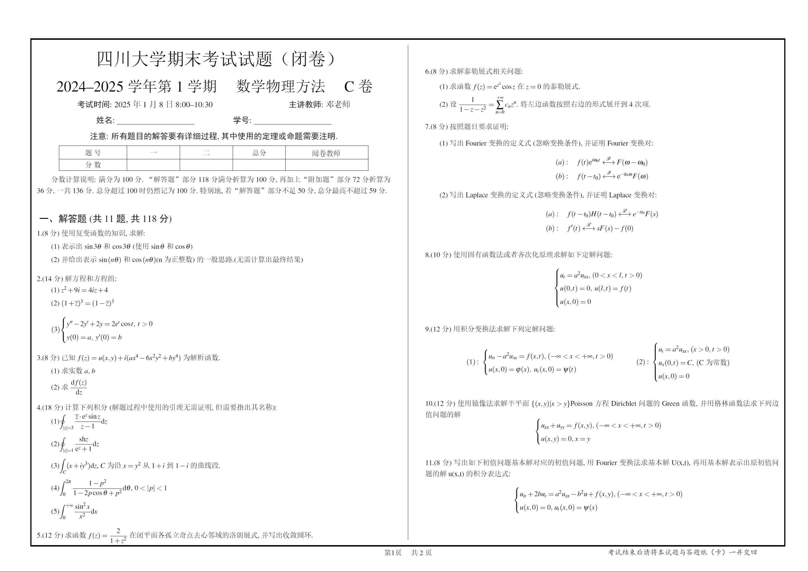

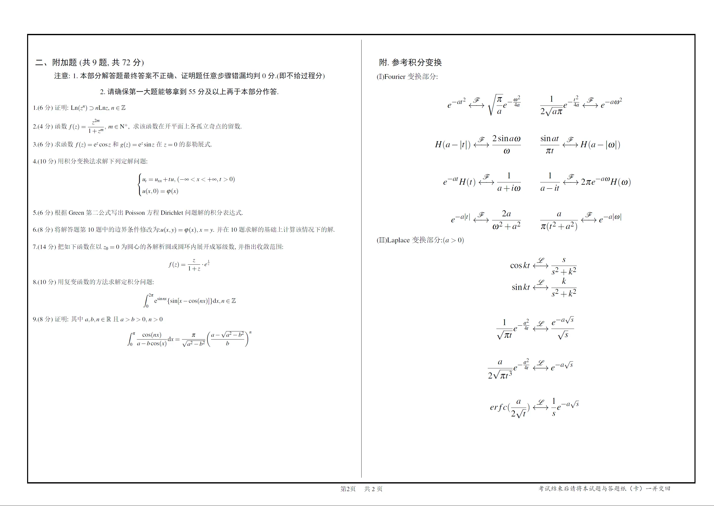

附加题部分, "注意"第二点中, 55分应修改为50分.(文件中也未修改)

附加题第8题来源: [请问这个定积分怎么求（可以用复变函数积分中的方法）？](https://www.zhihu.com/question/524839420)

## 答案和解析

使用了 exam-zh 的试卷模版(从页码可以看出), 取消了边线等内容

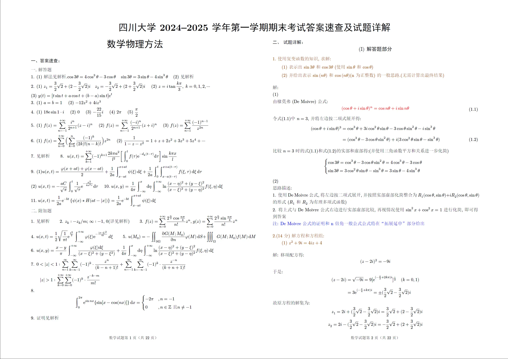

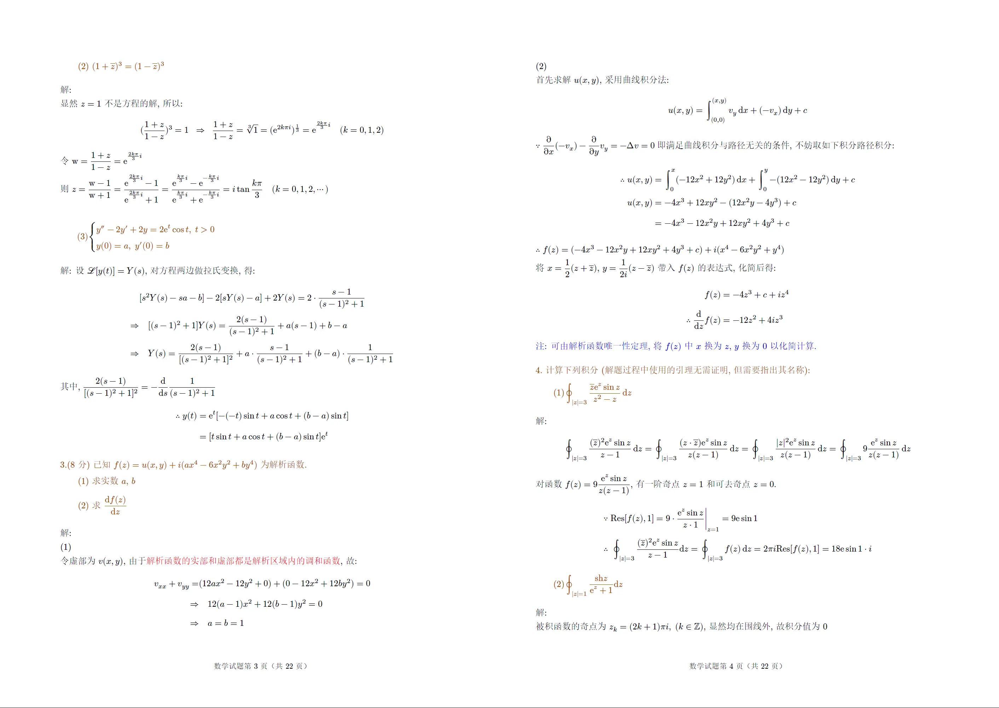

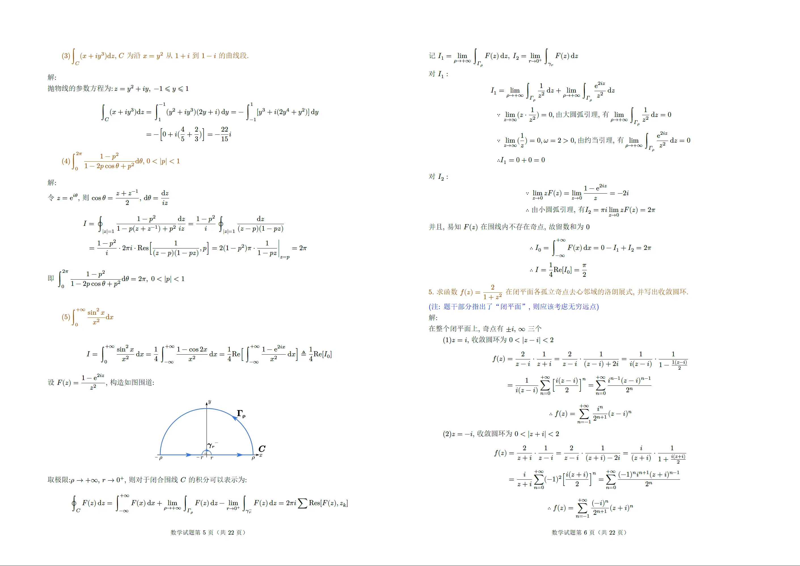

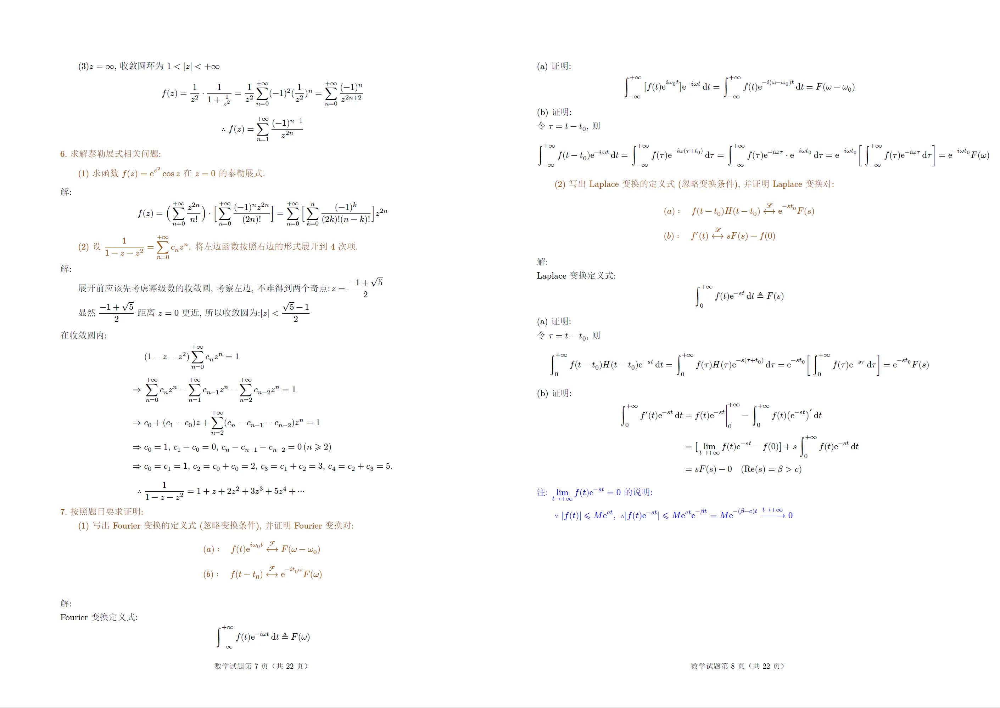

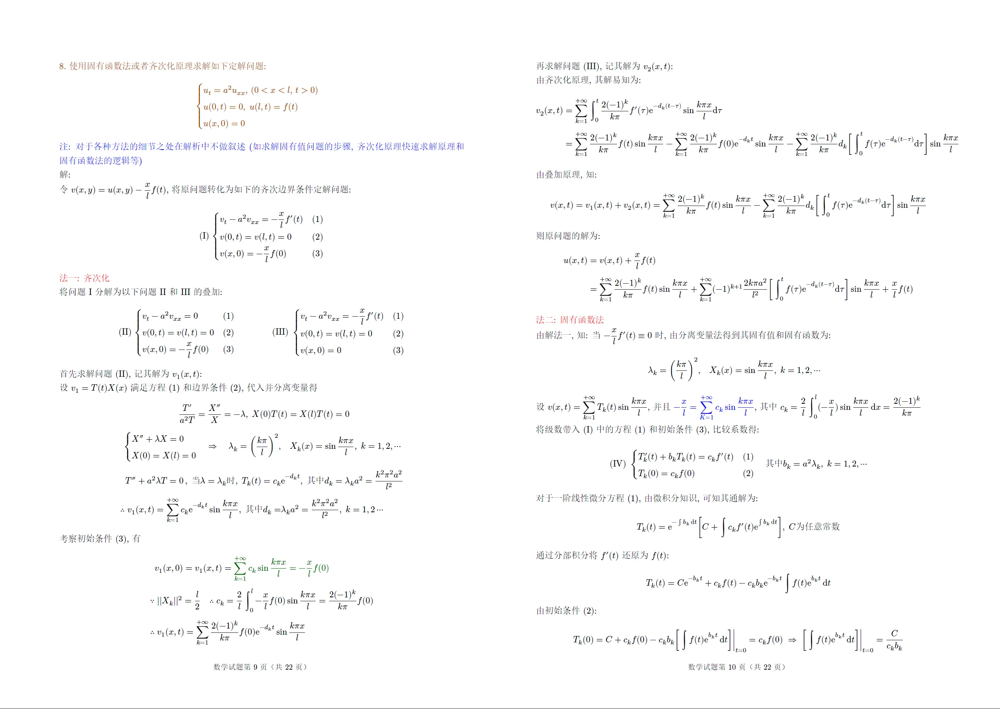

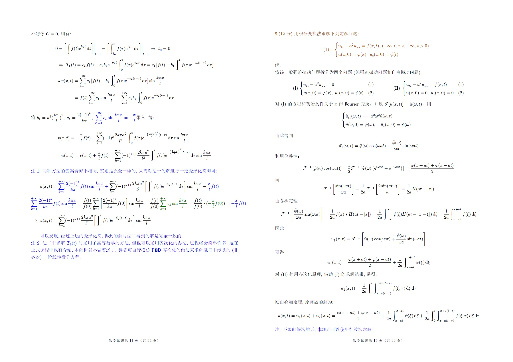

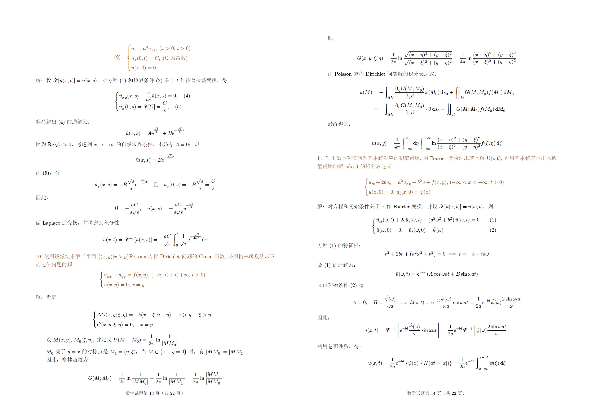

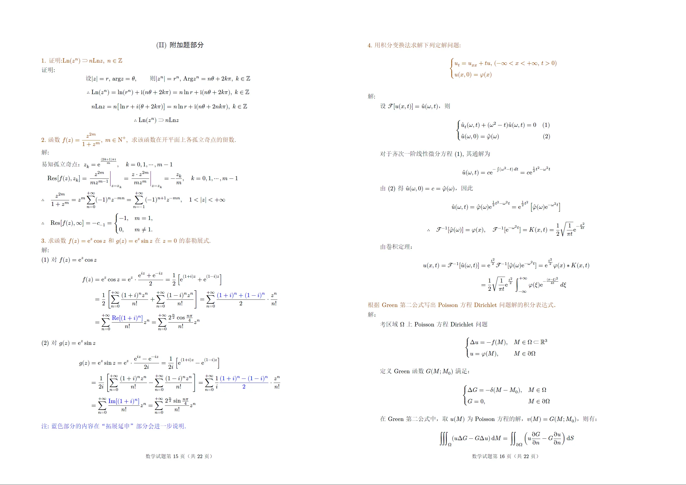

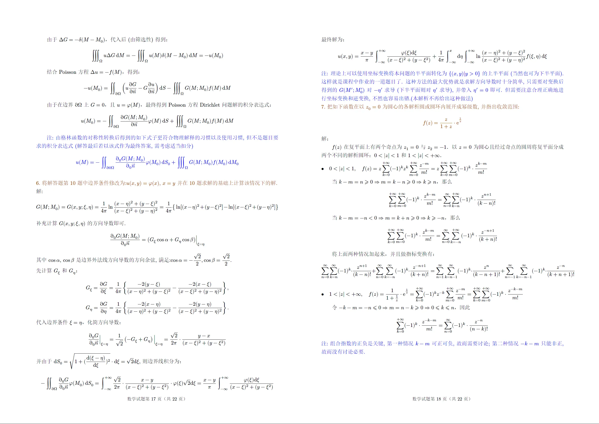

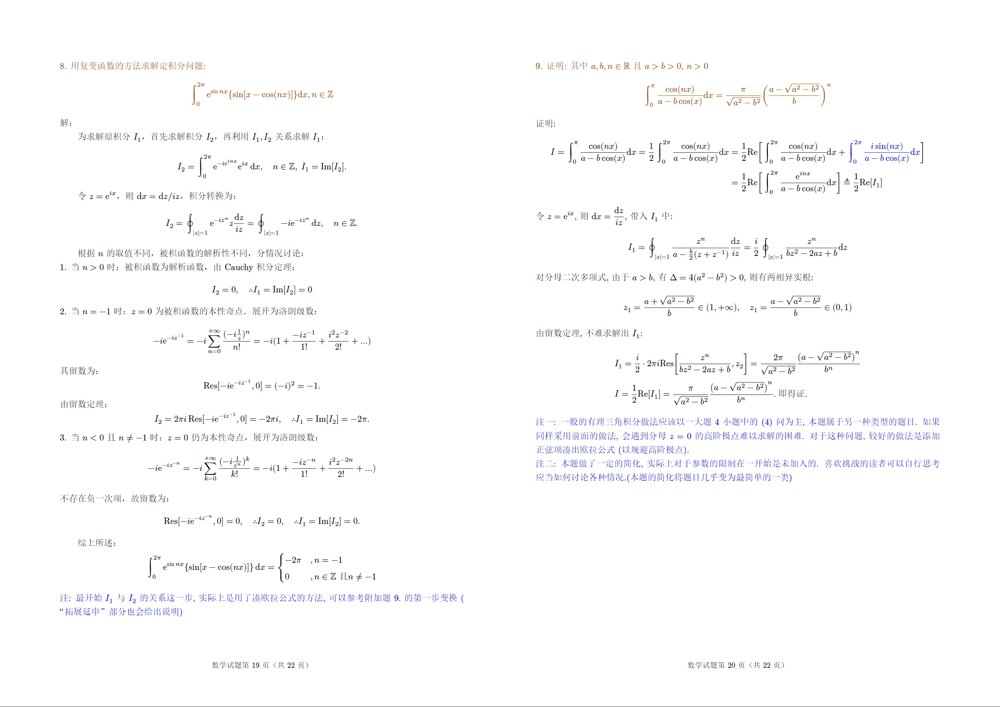

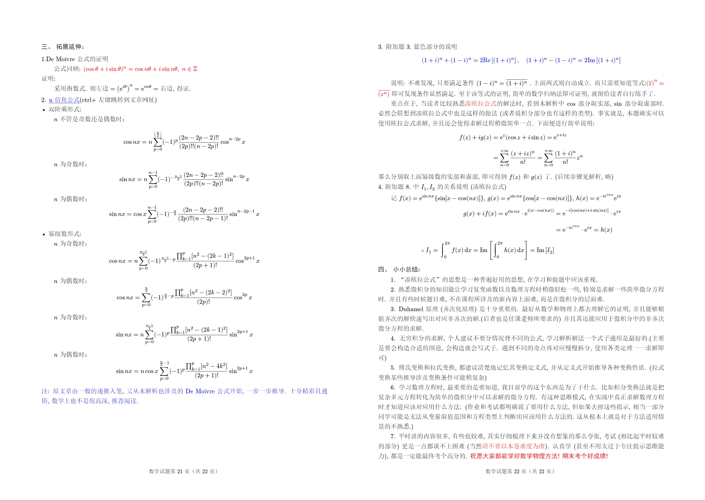

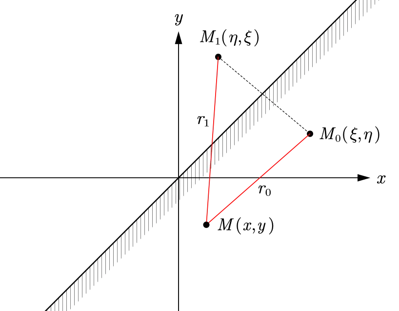

拓展延伸部分链接: n倍角公式的推导「全网最详细版」 (在pdf中ctrl+左键也可以跳转)

## 文件提供

- 截图或者保存图片的清晰度肯定不如直接阅读pdf.
- 所以建议有需要的读者在下方取得pdf文件使用. (文件均较小, 没有会员也可很快下载)

[试卷PDF](https://pan.baidu.com/link/zhihu/7hhWzauNh4iETHpVkXTD9S1UbwYw4WWwduJX==)

[解析PDF](https://pan.baidu.com/link/zhihu/7RhlzNuZh2iUNxBFd0csFVlDZmRlxWOQUWlG==)

Latex编辑渲染pdf, 所以并没有除pdf以外的形式. 不提供latex项目以及.tex源文件.

pdf文件添加了书签作为简单索引, 使用Acrobat软件体验效果最佳.