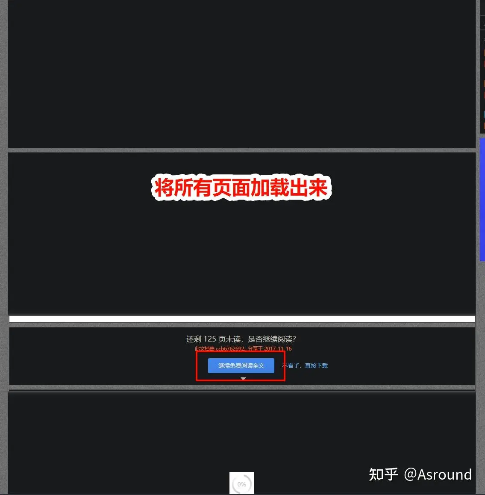
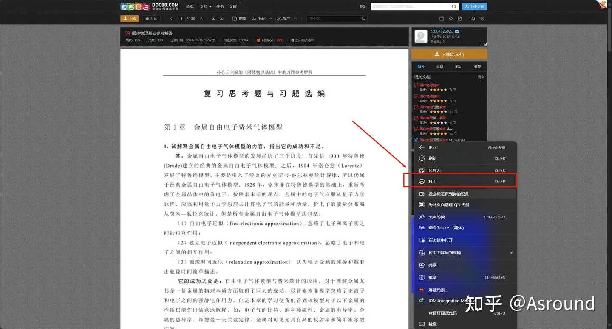
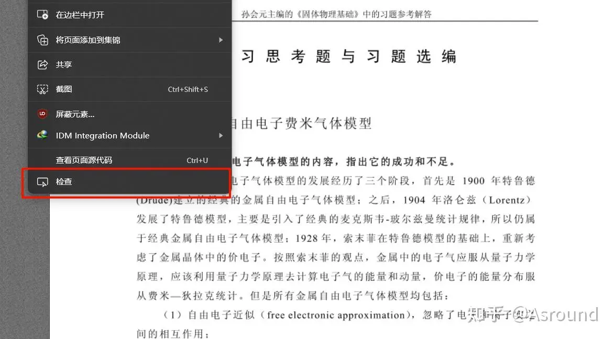
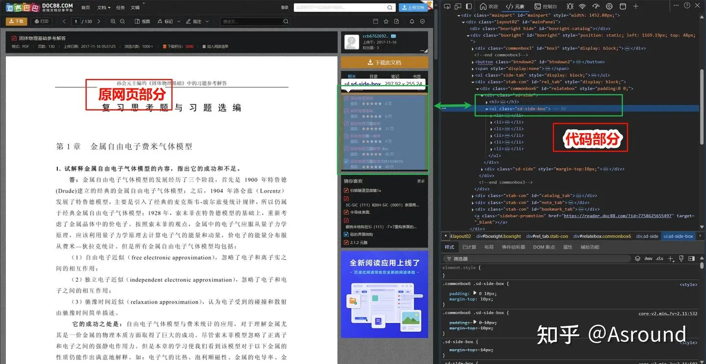
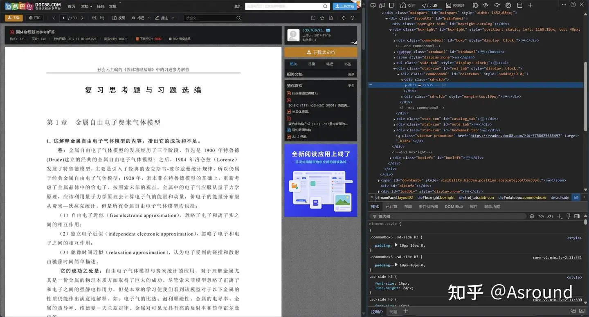
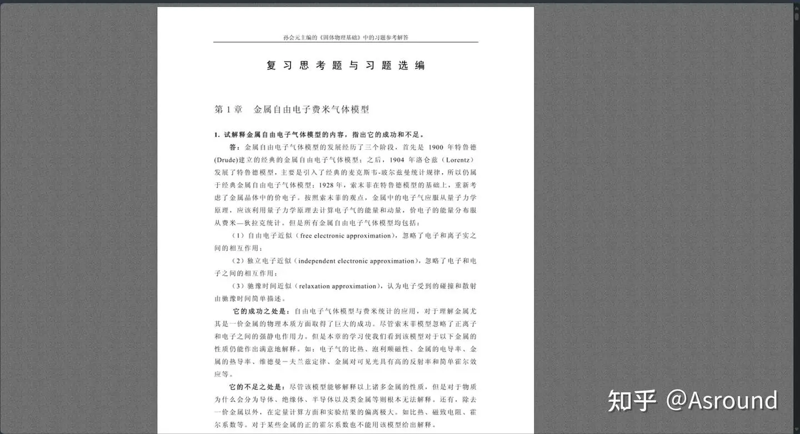
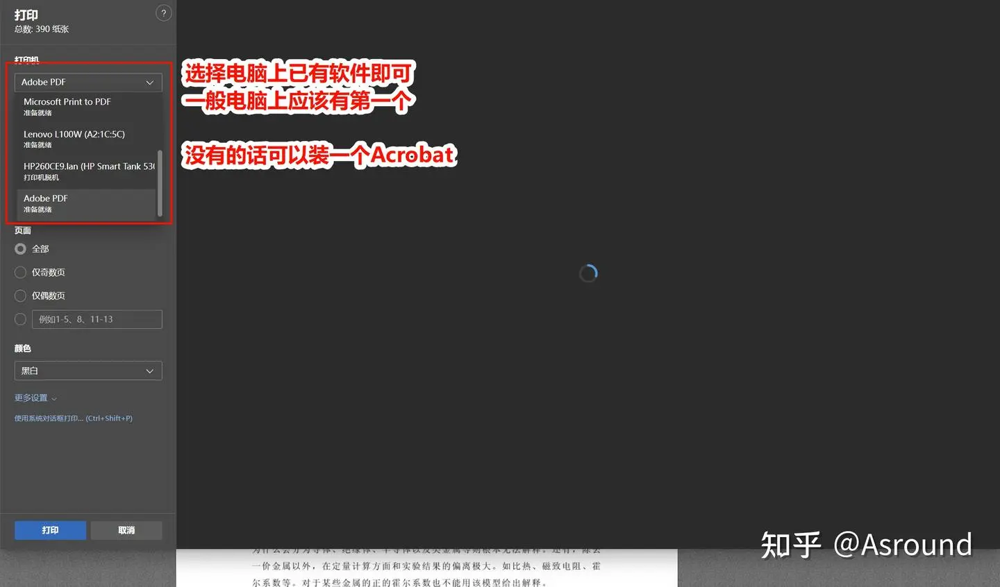
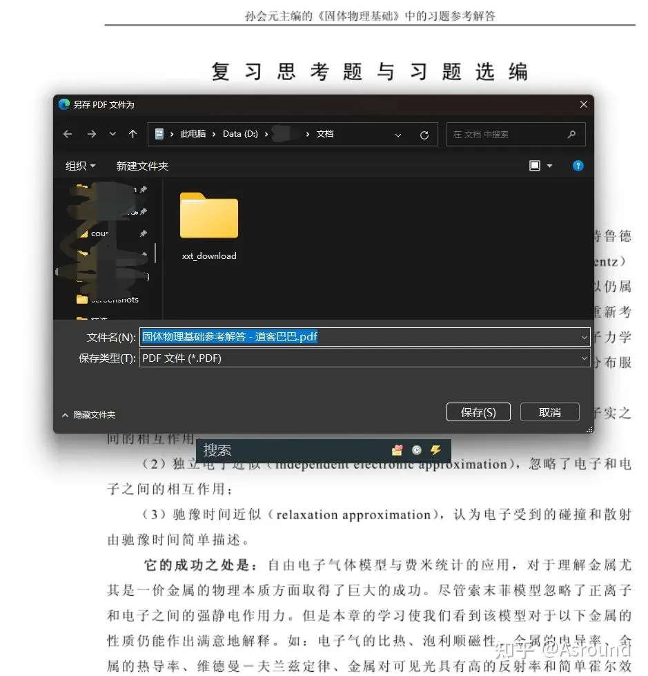
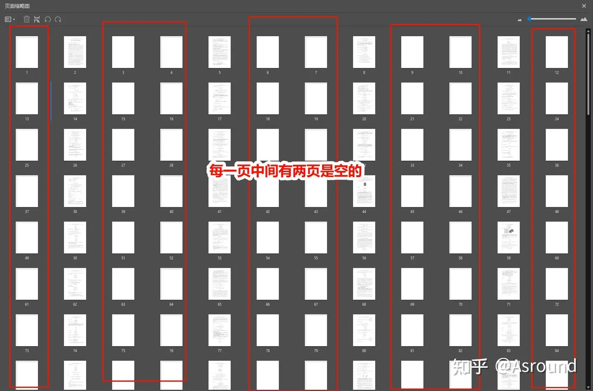
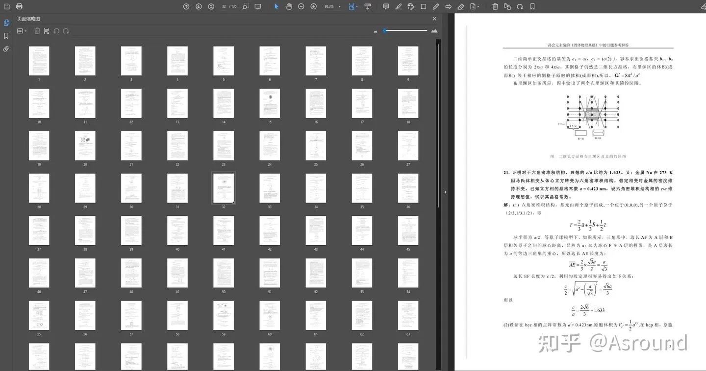

# 打印浏览器页面中 PDF 中的一种方法

> 最早发布在知乎: [保存道客巴巴pdf文档的一种方法](https://zhuanlan.zhihu.com/p/28993893004)

笔者在本学期修读固体物理, 需用到孙会元出版的《固体物理基础》的习题解答. zlib上搜索未果, 在道客巴巴和原创力文档上看到有资源. 虽可免费查看全文, 但依然不如在本地使用acrobat等软件自定义添加书签和批注方便. 故开始搜寻方法以在无会员情况下保存pdf.

本文记录了笔者的探究过程, 后续也给出了方法简介.

## 探究背景

首先在知乎上搜索, 推荐使用油猴脚本, 使用后发现无作用.(推测为文档太长而致, 保存pdf或者zip均行不通)

后看到使用直接"打印"的方式, 简单看了一下原理, 于是开始自己实践.

## 方法介绍和尝试过程

说明:

- <font color=red>**如果不能免费查看全文的, 此方法不可用!**</font>
- 笔者使用的是edge浏览器, 其他浏览器不保证方法可用.
- 并且装有dark reader插件,, 所以为整体深色调.(这不影响结果)

---

**1. 打开网站(此处便不给出了), 界面如下**:


- 我们这里先做一点准备工作, **加载全部页面(加载全了才能打印嘛, 不然是空白的哦!)**
  - 点击阅读全文
  - **慢慢**下拉加载每一个页面(**一定要加载完, 不然会有空白页!**)



加载完后,我们就要将网页内容进行保存了.

右键空白处, 可以看到"打印"选项:



但此时如果我们直接打印的话, 会保留"上传用户", "相关文档"等不需要的内容.(如果你不介意的话那也行)

所以我们需要去除这些内容, 尽量只保留预览pdf的窗口.

- 相信看到这里, 一些有经验的读者已经知道"检查元素"可以做到这件事了, 所以接下来进行第二步:

---

**2. 用"检查"窗口, 去除不需要的内容**:

右键空白处, 点击红色框中的"检查"



在右边会出现一些代码, 如下图:



简单来说, 右边绿色框中的代码决定了左边绿色框中的内容呈现.

我们只需要删除这部分代码(键盘Del/Delet 键), 那么对应左侧绿色框中内容就消失了, 如下图:



那么我们只需要一一删除直至满意即可.

但有个小问题, 比如我要删除"下载此文档"(图中右上, 黄色)按钮, 我应该怎么找对应代码呢? 一个一个点吗?

并不用, 只需右键你想删除的那个区域, 再点击之前见过的"检查"就行了(自己实操一下很快就能理解).

我自己删除之后得到了以下界面:



注意: 网页下拉, 底部也有很多东西要删除哦

删除干净(自认为干净即可), 继续.

---

**3. 打印页面**:

有两种方式:

- 第一是之前有的右键"打印"
- 第二是 使用快捷键 `Ctrl+P`(和第一种效果一样) 或者 `Ctrl+Shift+P`(调用系统打印页面)

以下演示第一种(和前文保持一致):



没有加载出来无所谓, 直接点击打印即可.



由于文档较长, 要过一定时间才会保存下来, 需要耐心等待.(保存好后应该会自动打开文档)

---

**4. 查看文档**:

我的文档保存出来是这个样子的:



页面没有缺失, 就是多了很多空白页(也不是全空白, 有一条线).

- 解释一下这种情况是怎么出现的(个人理解): 这是由于删除元素时, 并没有将页面最边角的内容删掉, 导致其实看似什么都没有的边框中还有部分内容, 打印的页面比 A4 (默认大小) 大, 就会溢出到新的一页.

- 解决办法也有两种:
  1. 在打印页面的左边, 下方还有一个选项 **"更多设置", 在里面将"边距"改成"无"**. 进一步还可以 **在"缩放(%)"中使用具体数值缩放调整页面大小**(需要耐心等待右边页面预览显示出来, 不然你也不知道缩放效果, 对吧)
  2. 使用一点简单的编程技巧

方法 1 是本文初次发在[知乎](https://zhuanlan.zhihu.com/p/28993893004)上时网友给的办法, 就不展示了. 读者可自行探索一下, 熟悉打印页面的设置. 这里简单讲一下笔者当时使用的方法 2.

---

**5. 编程提取有用页面**:

页数太多, 手动删除是很麻烦的. 软件也只能批量处理奇数或者偶数页面.

所以此时需要一点编程介入.(如果你的文档页面不多, 直接手动删除即可)

由于本人没有处理 pdf 的经验, 故使用了AI进行辅助, 给ds的描述如下:

> 写一个python程序, 里面封装一个函数, 提取pdf中指定的页面, 将这些页面按照原文档顺序组成一个新的pdf文档, 输出到原文档目录下.
> 要求: 可以指定从某一页x开始, 每隔y页提取一页内容.
> 参数: pdf_path, x, y
> 如: x=2, y=2, 即提取 第 2, 5, 8, 11 ...(表达式为2+3n)页的内容

当然, deepseek 给我的第一版实施下来有问题, 我自己查看代码逻辑之后简单改正就能达到效果, 代码如下:

```py

import os
from PyPDF2 import PdfReader, PdfWriter

def extract_pages(pdf_path, x, y):
    # 读取原始PDF文件
    reader = PdfReader(pdf_path)
    writer = PdfWriter()

    # 获取PDF的总页数
    total_pages = len(reader.pages)

    # 提取指定页面
    for i in range(x - 1, total_pages, y+1): # ds这里没有加一
        page = reader.pages[i]
        writer.add_page(page)

    # 生成新的PDF文件名
    base_name = os.path.splitext(os.path.basename(pdf_path))[0]
    output_pdf_path = os.path.join(os.path.dirname(pdf_path), f"{base_name}_extracted.pdf")

    # 将提取的页面写入新的PDF文件
    with open(output_pdf_path, "wb") as output_pdf:
        writer.write(output_pdf)

    print(f"提取的PDF已保存到: {output_pdf_path}")


# 示例调用
pdf_path = "pdf.pdf"  # 替换为你的PDF文件路径
x = 2  # 起始页
y = 2  # 间隔, 每隔几页提取(隔的都不提取)
# 即提取 x + n(y+1) 的页面, 此处为 2 5 8 11 ...
extract_pages(pdf_path, x, y)

```

- 需要提前安装库PyPDF2
- 需要一定的python知识, 但都不难

查看创建的pdf文档, 就大功告成啦!



## 总结

- **步骤归纳:**
  1. 找到一个可以查看全文档的网页, 并且是下拉式, 可以在一个网页中全部展示出的那种(点一下出来下一页的, 不行)
  2. 点击查看全文档, 命慢慢下拉加载全部页面
  3. 用检查元素清楚所有不需要的元素, 保留原文档内容即可
  4. 用edge浏览器, 右键"打印"功能打印全部页面, 确认保存路径, 耐心等待pdf出现
  5. 若pdf有空白页, 修改打印设置或者手动/编程删除

- **注意:**
  1. 需会员查看全文的, 笔者没有办法
  2. 一定注意加载全部页面
  3. 如果空白页面出现不规律, 有连续多张空白页面出现, 大概率是你没有加载全部页面
  4. 使用edge浏览器, 其他浏览器应该可仿照此法(但笔者还未实践)
  5. 保存的是图片, 而不是可编辑的文字. (原文档似乎也只是图片)